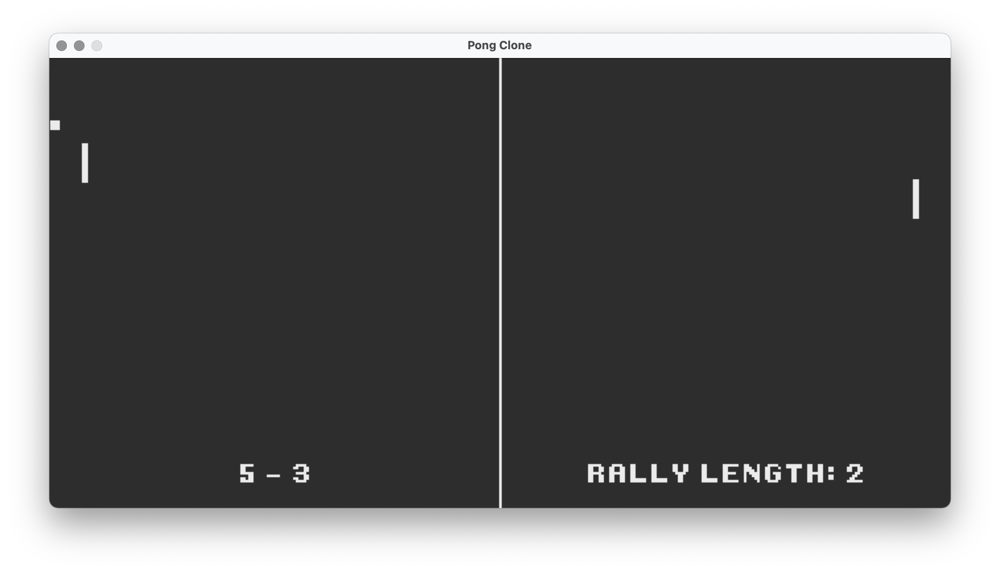
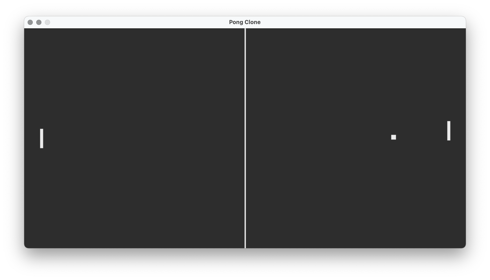
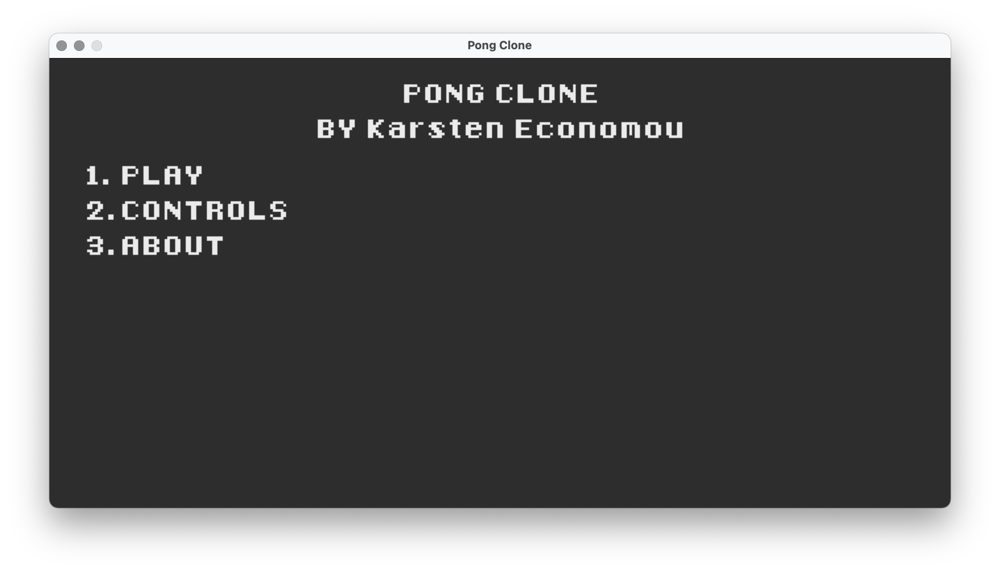

# Pong Clone

This repository contains a personal rendition of the classic arcade video game 
[*Pong*](https://en.wikipedia.org/wiki/Pong) using Python 3.9.
Author is Karsten Economou.

## How to play
This rendition of *Pong* is a two-player game where each player controls a paddle that can be moved vertically, each positioned on opposite ends of the screen. A ball is released in a random direction that moves with uniform horizontal and vertical speed, bouncing off the vertical bounds of the screen and each player's paddle. If a ball makes it past a player's paddle and contacts the horizontal bound of the screen behind it, the opposing player wins the point.

The score is tracked indefinitely during a session, allowing for uninterrupted and flexible playing.

### Difficulties
Two difficulty settings are available to be picked when choosing to play a game:

* Standard: The standard game experience.

* Nadal on clay: A more difficult game experience where ball and paddle speed is doubled.

### Controls
Controls (also documented in-game) are:

* Left Paddle
    * MOVE UP: W
    * MOVE DOWN: S

* Right Paddle
    * MOVE UP: I / UP ARROW
    * MOVE DOWN: K / DOWN ARROW

* Menus
    * INTERACT: 1, 2, and 3
    * MAIN MENU: ESCAPE
    * NEW POINT: SPACE

## Acknowledgements
* Font used is [8-Bit Madness](https://www.dafont.com/eight-bit-madness.font) by Tyler Dunn
* Sound bites created using [BeepBox](https://www.beepbox.co) by John Nesky

## Images

